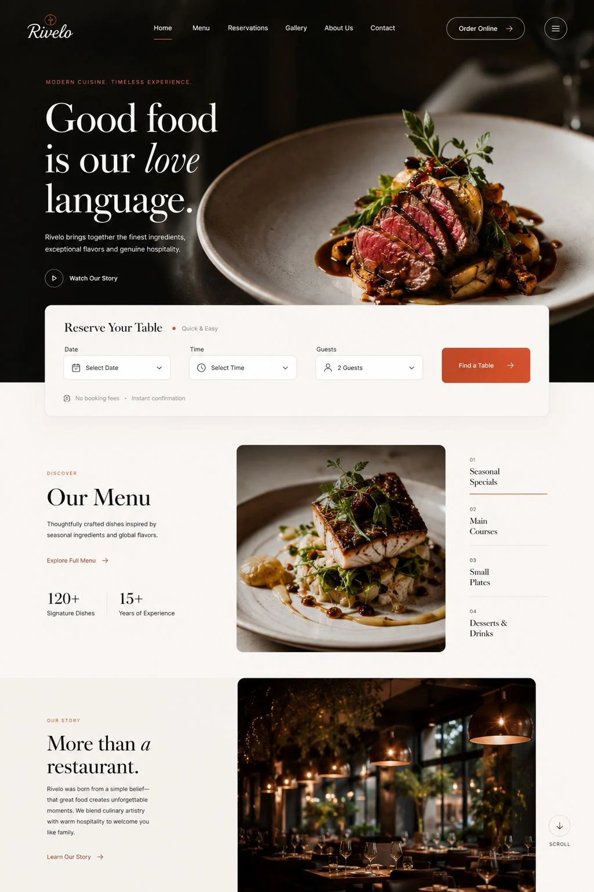
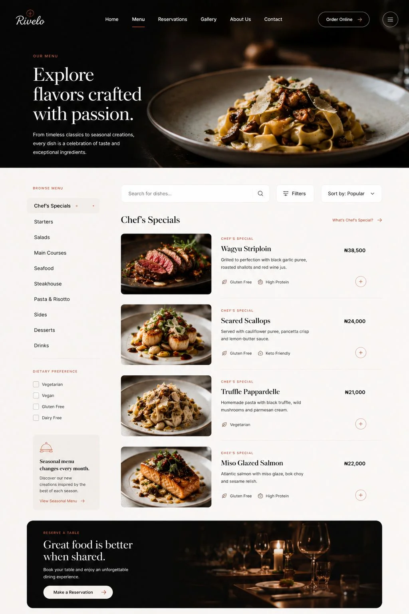
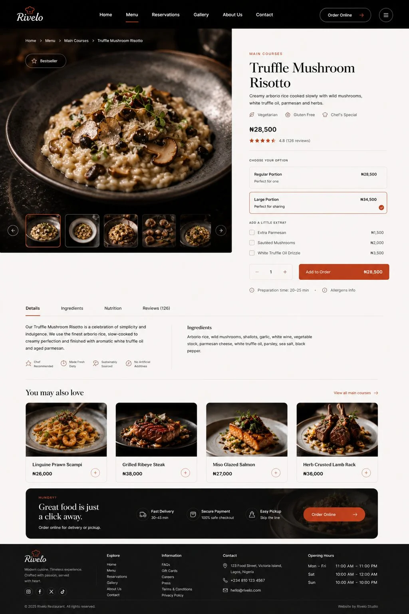
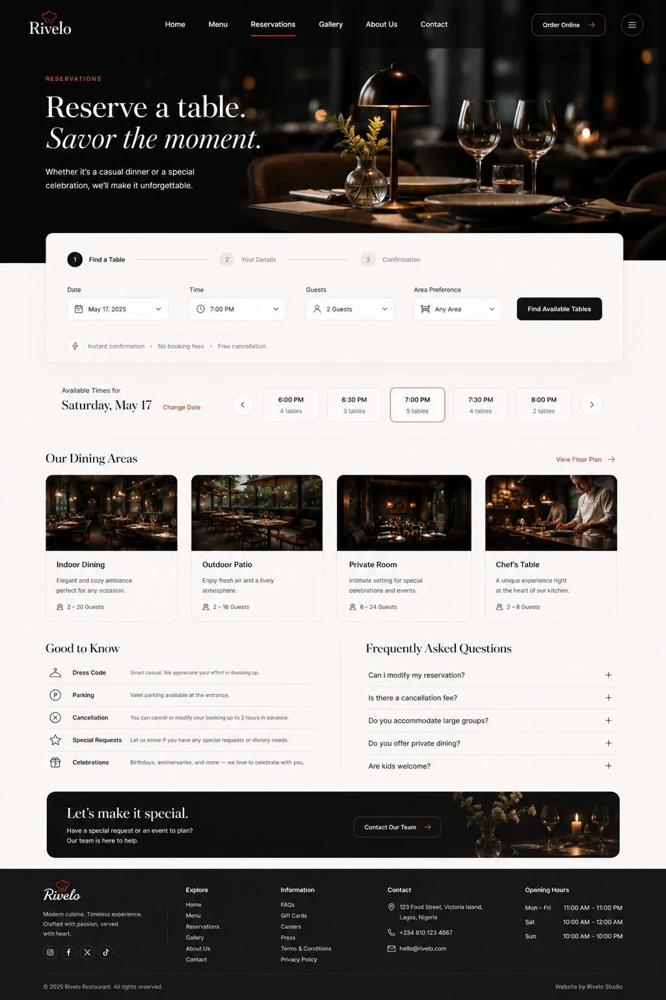
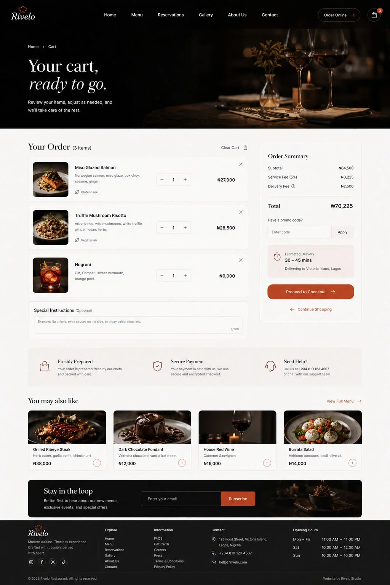

<div align="center">

# Ember & Sage

**A premium restaurant experience shaped by warmth, restraint, and modern editorial design.**

[View Live Site](https://embersage.vercel.app)

</div>

<br />

<p align="center">
  
</p>

## Overview

Ember & Sage is a full-stack restaurant product being developed in phases around an intimate, high-end dining experience. Its current frontend foundation combines cinematic imagery, editorial typography, warm colour, and clear interaction design across menu discovery, reservations, and ordering.

The project explores how a restaurant website can feel atmospheric and distinctive without sacrificing usability. Every screen belongs to one coherent product journey rather than a collection of disconnected landing-page sections.

## Experience

- Editorial homepage with menu, story, experience, and gallery previews
- Searchable and filterable menu presentation
- Data-driven dish pages using dynamic route parameters
- Portion selection and related-dish recommendations
- Reservation booking interface
- Frontend flows for cart, checkout, order success, and order tracking
- Gallery, About, Contact, and custom not-found pages
- Responsive navigation and layouts across desktop and mobile
- Reusable components, shared visual tokens, and structured page sections

## Screens

<!-- Update these filenames if your local WebP files use different names. -->

<table>
  <tr>
    <td width="50%">
      
    </td>
    <td width="50%">
      
    </td>
  </tr>
  <tr>
    <td align="center"><strong>Menu discovery</strong></td>
    <td align="center"><strong>Dish details</strong></td>
  </tr>
  <tr>
    <td width="50%">
      
    </td>
    <td width="50%">
      
    </td>
  </tr>
  <tr>
    <td align="center"><strong>Reservations</strong></td>
    <td align="center"><strong>Order cart</strong></td>
  </tr>
</table>

## Technology

| Tool | Purpose |
| --- | --- |
| React 19 | Component-based interface development |
| TypeScript | Type-safe application code |
| React Router 7 | Client-side routing and dynamic dish routes |
| Tailwind CSS 4 | Responsive styling and design tokens |
| Vite 8 | Development server and production build tooling |
| Lucide React | Consistent interface iconography |

## Routes

| Route | Screen |
| --- | --- |
| `/` | Home |
| `/menu` | Menu |
| `/menu/:dishId` | Dish details |
| `/reservations` | Reservations |
| `/gallery` | Gallery |
| `/about` | About |
| `/contact` | Contact |
| `/cart` | Cart |
| `/checkout` | Checkout |
| `/order-success` | Order confirmation |
| `/order-tracking` | Order tracking |

## Getting started

### Prerequisites

- Node.js 20 or later
- npm

### Installation

```bash
git clone https://github.com/Davemafy/Ember-And-Sage.git
cd Ember-And-Sage
npm install
npm run dev
```

Open the local URL shown by Vite in your browser.

## Available scripts

```bash
npm run dev      # Start the development server
npm run build    # Type-check and create a production build
npm run lint     # Run ESLint
npm run preview  # Preview the production build locally
```

## Project structure

```text
src/
├── components/
│   ├── cards/       # Reusable content and dish cards
│   ├── layout/      # Shared navigation, footer, and layouts
│   ├── sections/    # Page-specific content sections
│   └── ui/          # Reusable interface primitives
├── data/            # Menu and application data
├── pages/           # Route-level screens
├── App.tsx          # Router provider
├── router.tsx       # Application route definitions
└── index.css        # Global styles and design tokens
```

## Design direction

The visual system is built around near-black surfaces, warm ivory, restrained burnt-orange accents, high-contrast serif typography, and generous spacing. The result aims to feel cinematic and refined while keeping the core actions—discovering dishes, reserving a table, and placing an order—easy to understand.

## Development roadmap

Ember & Sage is being built toward a complete restaurant platform, not a frontend-only concept. The current phase establishes the customer experience, reusable interface system, and full route structure. The next phase will connect those flows to real application data and restaurant operations.

- [x] Responsive customer-facing interface
- [x] Menu data and dynamic dish pages
- [x] Reservation, cart, checkout, and tracking interfaces
- [ ] Backend API and database
- [ ] Persistent carts and customer orders
- [ ] Live reservation availability and booking records
- [ ] Secure payment integration
- [ ] Real order-status updates
- [ ] Restaurant management tools

## Author

Designed and developed by [David Imafidon](https://github.com/Davemafy).
