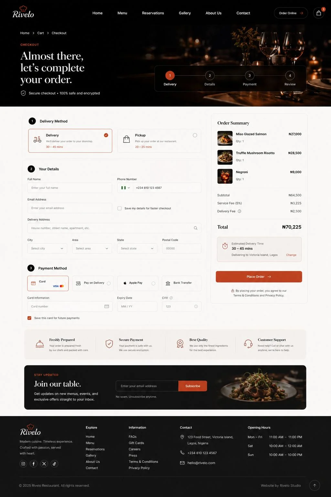

# Ember & Sage

A cinematic restaurant website experience for modern dining brands.

Ember & Sage is a premium restaurant website concept built by **David Imafidon** under **Rivelo Studio**. It is designed for restaurants that want more than a basic menu page — a warm, editorial, high-end digital experience that helps guests explore the menu, reserve a table, contact the restaurant, and move through an online ordering flow.

  

## Live Experience

[Visit the live site](https://embersage.vercel.app)

## The Vision

Most restaurant websites feel generic: a hero image, a menu PDF, a few cards, and repeated “Book Now” buttons.

Ember & Sage takes a more refined direction.

The goal is to create a restaurant website that feels like the beginning of the dining experience itself — cinematic, intimate, warm, and carefully paced.

This project is built to work as both:

- a premium frontend portfolio project
- a reusable restaurant website foundation for future client work under Rivelo Studio

## Screens

### Menu Discovery

Guests can browse the menu, view chef’s specials, and open individual dish detail pages.

  

### Reservations

A polished reservation flow helps guests choose date, time, guests, dining area, and understand booking details.

  

### Ordering Flow

The static order journey includes cart, checkout, order confirmation, and order tracking screens.

  

## Customer Journey

Ember & Sage includes a complete static restaurant website flow:

- Home
- Menu
- Dish Details
- Reservations
- About
- Gallery
- Contact
- Cart
- Checkout
- Order Success
- Order Tracking

## Design Direction

The visual system is built around a premium hospitality feel:

- Near-black backgrounds
- Warm ivory typography
- Restrained burnt-orange accents
- Editorial serif headings
- Generous whitespace
- Cinematic food and interior imagery
- Mobile-first layouts
- Subtle, purposeful interaction
- Refined cards and spacing

The goal is to avoid the usual restaurant-template look: generic cards, obvious food clichés, excessive calls to action, and layouts that feel AI-generated.

## Built With

- React
- TypeScript
- Vite
- Tailwind CSS
- React Router
- Lucide React
- Vercel

## Current Status

The core static site flow is built and deployed.

The next phase is focused on polish:

- Matching the implementation more closely to the design references
- Replacing placeholder image blocks with premium food and interior visuals
- Improving spacing, rhythm, and typography
- Strengthening desktop responsiveness
- Refining navigation and user flows

## Project Intent

Ember & Sage is frontend-focused. It does not currently include backend functionality, authentication, real payments, or persistent cart state.

The focus is on visual execution, responsive frontend architecture, polished product flow, and building a restaurant website strong enough to present to real restaurant clients.

## Created By

Built by **David Imafidon**  
A Rivelo Studio project